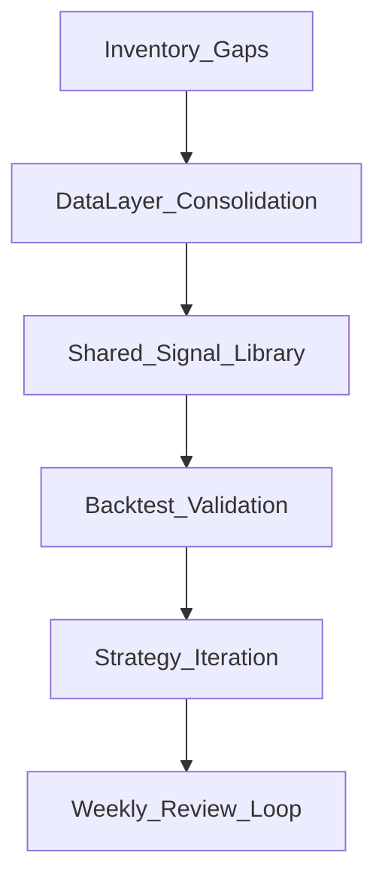

# Trading Agent Project Review & Next Steps

**Review Date:** 2026-01-16  
**Focus Areas:** Full project review, Strategy/Signals, Data Quality, Backtesting

---

## Current Strengths

### 1. Research Foundation
- Extensive strategy iteration documented in `docs/STRATEGY_ITERATION.md` with concrete backtest results
- Adaptive strategy validated: 30% pass rate across symbols/timeframes, best among tested approaches
- Volume Pullback pattern backtested with 87% win rate on optimal setup (260 samples)
- Clear success criteria defined: WR >60%, Sharpe >0, beat B&H/SPY

### 2. Data Infrastructure
- SQLite cache layer (`src/data_manager.py`) with 177k+ rows of daily OHLCV data
- Thread-safe operations, automatic freshness checking, incremental updates
- Fundamental data caching with weekly refresh
- Bulk preload for scanner efficiency

### 2.1 Recent Progress (since review)
- **Cache correctness improved** (`src/data_manager.py`)
  - Added **coverage checks**: requesting `2y` won’t silently return `1y`
  - Standardized outputs: API fetches now return a **DatetimeIndex** (prevents backtests silently failing)
- **Pattern backtest + phase scan exported** (cache-first)
  - Historical instances: `results/pattern_backtest_2y.csv` (filtered to remove 1-day “outcomes”)
  - Current phases (PHASE 1+ only): `results/pattern_phases_2y.csv`
- **Scanner output quality improved** (`tools/scanner.py`)
  - Volume-pullback is now **“pattern detected” vs “tradeable A+”**
  - Prevents false “opportunities” like IBM; prints blockers when WAIT
- **Tools cleanup started**
  - Moved implementations into `src/tools/` (keep `tools/` as thin shims)
  - Deprecated duplicate CSV cache (`tools/data_cache.py`) in favor of SQLite cache
- **Process guardrails encoded**
  - Added Cursor rule: `.cursor/rules/trading-agent.md` (src-first, cache-first, explain opportunities)

### 3. Operational Workflow
- Daily scanner with email automation (`tools/daily_scanner_email.py`)
- Portfolio tracking via JSON (`data/portfolio.json`, `data/my_portfolio.json`)
- Signal journal for outcome tracking
- Versioned scanner changelog with rationale

### 4. Documentation
- SOP defines code organization rules (`src/` vs `tools/` vs `scripts/`)
- Strategy matrix documented for regime/volatility combinations
- Lessons learned system with daily review process

---

## Failures & Gaps

### Critical: Architecture Doc vs. Reality Mismatch

The `docs/TRADING_SYSTEM_V2.md` describes modules that **do not exist**:

| Documented Module | Actual Status |
|-------------------|---------------|
| `src/regime/` | **Missing** - regime logic lives in `tools/scanner.py` |
| `src/picker/factors/` | **Missing** - no momentum/quality/value/technical factor modules |
| `src/execution/adapters/` | **Missing** - no `ibkr_adapter.py` or `paper_adapter.py` |
| `src/universe/screener.py` | Exists but underutilized |
| `src/portfolio/allocation.py`, `rebalance.py` | **Missing** |
| `src/performance/attribution.py` | **Missing** |
| `tests/integration/`, `tests/e2e/` | **Missing** |

**Impact:** New development builds on a foundation that doesn't exist. The aspirational architecture creates confusion about what's actually usable.

### Critical: Duplicated Data Layer

Two different `DataManager` classes exist:

1. **`src/data_manager.py`** - SQLite cache + yfinance, daily data, used by scanner
2. **`src/data/data_manager.py`** - IBKR multi-timeframe manager, disk cache

**Impact:** Scanner and backtests may use different data sources. No guarantee of consistency between development/live.

### Critical: Core Logic in Wrong Location

`tools/scanner.py` contains ~1,200 lines of core business logic:
- `Regime` and `VolCategory` enums
- `STRATEGY_MATRIX` dictionary
- EV calculation, risk/reward analysis
- Position sizing (Kelly, vol-targeting)
- Pattern detection (`detect_volume_pullback_pattern`)

**Impact:** Cannot reuse this logic in backtests or live trading without importing from `tools/`. Violates the SOP that says `src/` holds core logic.

### Major: Backtest/Scanner Signal Divergence

- `src/signals/entry/volume_pullback_entry.py` has a `VolumePullbackEntrySignal` class
- `tools/scanner.py` has a separate `detect_volume_pullback_pattern()` function
- These are **not the same implementation**

**Impact:** Backtest results may not match scanner signals. Pattern changes require updates in multiple places.

**Progress:** Pattern backtest has begun migrating to use the shared signal class (`src/tools/pattern_backtest.py` imports `VolumePullbackEntrySignal`). Scanner still uses `detect_volume_pullback_pattern()` and must be unified next.

### Major: Missing Backtest Rigor

- No walk-forward validation in current engine
- Transaction costs and slippage modeled but not consistently applied
- No holdout period separation documented
- Regime-specific performance not tracked in backtest outputs

### Minor: Test Coverage Gaps

- `tests/unit/` has minimal coverage
- No integration tests for picker pipeline or trading pipeline
- No e2e tests for paper trading validation

---

## Immediate Priorities (Do These First)

### Priority 1: Data Layer Consolidation

**Goal:** Single source of truth for all data access.

**Decision:** Use `src/data_manager.py` (SQLite cache) as the canonical layer.
- It's battle-tested (scanner uses it daily)
- Has 177k+ rows of cached data
- Supports the primary use case (daily OHLCV for scanning/backtesting)

**Actions:**
1. Rename `src/data/data_manager.py` to `src/data/ibkr_data_manager.py` to clarify purpose
2. Update `src/data/__init__.py` to expose both managers with clear names
3. Add a facade/factory in `src/data/__init__.py` that returns the appropriate manager based on config
4. Update all imports to use the facade

**Status (2026-01-16):**
- ✅ `src/data_manager.py` is enforced as canonical for scanning/backtesting
- ✅ Coverage + output-standardization fixes landed (prevents “2y requested but 1y returned” and date-index bugs)
- ⏳ Facade/rename work still pending

### Priority 2: Move Scanner Core Logic to `src/`

**Goal:** Scanner becomes a thin CLI wrapper; logic is reusable.

**Actions:**
1. Create `src/regime/` directory with:
   - `src/regime/classifier.py` - `Regime` enum + classification logic
   - `src/regime/volatility.py` - `VolCategory` enum + volatility classification
2. Create `src/strategy/` directory with:
   - `src/strategy/matrix.py` - `STRATEGY_MATRIX` and lookup functions
   - `src/strategy/ev_calculator.py` - expected value calculations
3. Move pattern detection to `src/signals/entry/` and unify with existing `VolumePullbackEntrySignal`
4. Refactor `tools/scanner.py` to import from `src/` and handle only CLI/output formatting

**Status (2026-01-16):**
- ✅ Output gating added (tradeable vs detected; IBM false-positive removed)
- ⏳ Core logic is still primarily in `tools/scanner.py` (migration pending)

### Priority 3: Unify Signal Implementations

**Goal:** One pattern implementation used by scanner, backtest, and live.

**Actions:**
1. Consolidate `detect_volume_pullback_pattern()` logic into `VolumePullbackEntrySignal.generate()`
2. Create `src/signals/scanner_adapter.py` that wraps signal classes for scanner use
3. Update backtest engine to use the same signal classes
4. Add integration test that verifies scanner output matches backtest signal detection

**Status (2026-01-16):**
- ⏳ In progress: backtest is being moved to use `VolumePullbackEntrySignal`
- ❌ Scanner still uses separate `detect_volume_pullback_pattern()` implementation

---

## Medium-Term Roadmap

### Phase 1: Foundation Cleanup (Immediate)
- [~] Data layer consolidation
- [ ] Scanner logic migration to `src/`
- [~] Signal implementation unification
- [ ] Update `docs/TRADING_SYSTEM_V2.md` to reflect actual architecture

### Phase 2: Backtest Hardening
- [ ] Add walk-forward validation mode to `src/backtest/engine.py`
- [ ] Standardize output metrics: WR, Sharpe, Max DD, vs B&H, vs SPY
- [ ] Add regime-specific performance breakdown
- [ ] Ensure transaction costs/slippage are always applied

### Phase 3: Strategy Encoding
- [ ] Implement Adaptive strategy in `src/signals/` based on `docs/STRATEGY_ITERATION.md` findings
- [ ] Encode regime-based position sizing in `src/sizing/`
- [ ] Add regime detection to risk management layer

### Phase 4: Testing & Validation
- [ ] Add integration tests for picker -> signal -> backtest pipeline
- [ ] Add paper trading e2e test
- [ ] Compare live scanner output to backtest predictions over 30-day period

---

## Metrics & Success Criteria

### Strategy Performance (from STRATEGY_ITERATION.md)
| Metric | Minimum | Target |
|--------|---------|--------|
| Win Rate | 60% | 65% |
| Sharpe Ratio | 0 | 0.5 |
| vs Buy-and-Hold | -5% | +5% |
| Max Drawdown | <15% | <10% |

### Code Quality
| Metric | Current | Target |
|--------|---------|--------|
| Core logic in `src/` | ~40% | 100% |
| Signal implementation duplication | 2 | 1 |
| Data manager implementations | 2 | 1 (with facade) |
| Integration test coverage | 0% | >50% |

---

## Risks

### 1. Refactoring Breaks Working Scanner
**Mitigation:** Create integration test that captures current scanner output for 10 symbols. After migration, verify output matches.

### 2. Backtest Results Change After Unification
**Mitigation:** Run backtest with current implementation, save results. After unification, compare. Document any differences with rationale.

### 3. IBKR Multi-Timeframe Use Case Abandoned
**Mitigation:** Keep `ibkr_data_manager.py` as a separate module. The facade can switch to it when live trading is enabled.

### 4. Feature Creep During Cleanup
**Mitigation:** Rule: No new strategy features until Priorities 1-3 are complete. This is now encoded in the Cursor rules.

---

## Recommended Review Flow

---

## Appendix: File Inventory

### Files Needing Migration (from `tools/` to `src/`)

| Current Location | Target Location | Content |
|------------------|-----------------|---------|
| `tools/scanner.py` lines 68-98 | `src/regime/classifier.py` | `Regime` enum, classification |
| `tools/scanner.py` lines 77-82 | `src/regime/volatility.py` | `VolCategory` enum |
| `tools/scanner.py` lines 104-135 | `src/strategy/matrix.py` | `STRATEGY_MATRIX` |
| `tools/scanner.py` EV calc logic | `src/strategy/ev_calculator.py` | Expected value functions |
| `tools/scanner.py` pattern detection | Merge into `src/signals/entry/volume_pullback_entry.py` | Volume pullback pattern |

Additional migrations already started:
- ✅ `tools/fundamental_analyzer.py` → implementation in `src/tools/fundamental_analyzer.py` (tools is shim)
- ✅ `tools/pattern_backtest.py` → implementation in `src/tools/pattern_backtest.py` (tools is shim)
- ✅ `tools/data_cache.py` deprecated (duplicate cache wheel); use `src/data_manager.py` SQLite cache instead

### Files Needing Consolidation

| File 1 | File 2 | Resolution |
|--------|--------|------------|
| `src/data_manager.py` | `src/data/data_manager.py` | Keep both, rename second, add facade |
| `tools/scanner.py` pattern | `src/signals/entry/volume_pullback_entry.py` | Merge into signal class |
