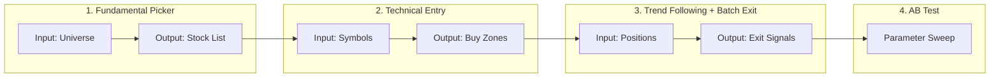

# Modular Pipeline Plan & Stock Picking Execution

This document describes the modular pipeline design and the stock picking execution workflow. It merges the former MODULAR_PIPELINE_PLAN.md and STOCK_PICKING_EXECUTION_PLAN.md.

---

## Pipeline Overview



---

## Stage 1: Fundamental Picker

**Purpose:** Generate a list of stocks meeting fundamental/financial requirements.

| Aspect | Specification |
|--------|----------------|
| **Input** | Universe (listed US symbols or upstream filter) |
| **Output** | Symbol list with fundamental metrics (CSV) |
| **Logic** | EPS YoY, revenue growth, ROE, gross margin, debt/equity |

### Current Picker Constraints (from `config/picker_config.yaml`)

| Layer | Criteria |
|-------|----------|
| Layer 1 (Technical) | RS rank >= 80, price >= 0.80 * 52w high, min 260 bars |
| Layer 2 (Fundamental) | EPS YoY >= 25%, revenue growth >= 10% |
| Layer 3 (Quality) | ROE >= 10%, gross margin rank >= 60, debt/equity <= 1.2 |
| Post-process | Share-class dedupe, remove ETFs, max 4 per industry |

### Execution Workflow

**Step A: Preflight Gate (auto)**
- Triggered inside `tools/run_three_layer_picker.py` before picker stages
- Purges invalid OHLCV rows, runs cache health checks, enforces strict thresholds
- PASS => continue; FAIL => abort (unless `on_fail: warn`)

**Step B: Stock Picker**
- Runs 3 layers: Technical -> Fundamental -> Quality
- Writes stage outputs to `results/picker/`

**Step C: Incremental Earnings Refresh**
- `tools/incremental_earnings_refresh.py`
- Detects new/revised earnings, ticker-scoped snapshot invalidation

**Step D: Earnings Session Calendar**
- `tools/earnings_calendar.py`
- Labels events as pre-market / post-market / in-market / unknown

---

## Stage 2: Technical Entry Signals

**Purpose:** For each qualified stock, find high R:R buy zones.

| Aspect | Specification |
|--------|----------------|
| **Input** | Symbol list from fundamental picker |
| **Output** | Per symbol: entry_price, entry_date, stop_loss, targets, risk_reward |
| **Logic** | Minor pullback zones, price buy zones, R:R targets, volume analysis |

**Output schema:**
```
symbol | entry_price | entry_date | stop_loss | target_1 | target_2 | risk_reward | setup_type
```

---

## Stage 3: Trend Following + Batch Exit

### 3a. Trend Following
- After position entry, follow trend or use resistance as exit levels
- Output: trailing stop levels, resistance targets

### 3b. Batch Exit
- Daily check: for each position, should we exit at current price?
- Interface: `check_all_positions(positions, prices, timestamp) -> List[ExitSignal]`
- Output: symbol, exit_price, exit_date, reason, exit_pct

---

## Stage 4: AB Test

| Tool | Role |
|------|------|
| `ab_test_targets.py` | Target methods (resistance, measured_move, fib, auto) |
| `ab_test_stoploss.py` | Stop-loss parameters |
| `ab_test_runner.py` | Partial exit variants |
| `ab_test_range_filter.py` | Range-bound filter |
| `sweep_tpsl_params.py` | TP/SL parameter sweep |

---

## Data Contracts

### Fundamental Picker Output
```
symbol, eps_yoy, revenue_growth, roe, gm_rank, composite, rs_rank
```

### Technical Entry Output
```
symbol, entry_price, entry_date, stop_loss, target_1, target_2, risk_reward, setup_type
```

### Batch Exit Output
```
symbol, exit_price, exit_date, exit_reason, exit_pct
```

---

## What To Do After Stock Picking

1. Generate execution-ready trade list with entry/stop/targets, risk-per-trade caps, position sizes
2. Flag earnings-session proximity (avoid new entries near binary events)
3. Run walk-forward spot checks on impacted windows
4. Produce end-of-run artifacts: picks CSV, risk budget table, execution queue

---

## Data Validity Policy

- Date keys are non-negotiable: Price cache uses `Date`; quarterly fundamentals use `report_date`, `disclosure_date`
- `NaN/NaT` in required date keys is a bug signal; rows are dropped, never date-prefilled
- `None` allowed only for optional numeric fundamentals when provider has no value
- No zero/placeholder prefills for missing growth metrics

---

## Refactor Status

| Phase | Description | Status |
|-------|-------------|--------|
| Phase 1 | Move heavy tool logic into `src/` (cache-health, incremental refresh) | Completed 2026-02-16 |
| Phase 2 | Shared data contracts + audit model | Planned |
| Phase 3 | Orchestrated production pipeline | Planned |
| Phase 4 | Test hardening (NaN-date, no-prefill, end-to-end gating) | Continuous |

---

## Quick Start

```bash
# Run embedded picker (preflight + earnings-refresh auto-run)
python3 tools/run_three_layer_picker.py

# Fundamental-only mode (skip technical layer)
python3 tools/run_three_layer_picker.py --fundamental-only

# Walk-forward validation
python3 tools/validate_three_layer_walkforward_tpsl.py

# Earnings calendar for final candidates
python3 tools/earnings_calendar.py --symbols-file results/picker/three_layer_picks.csv --days-ahead 14
```
